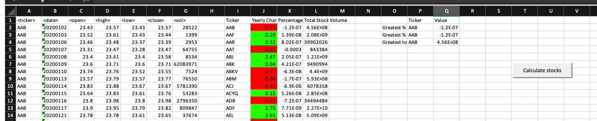
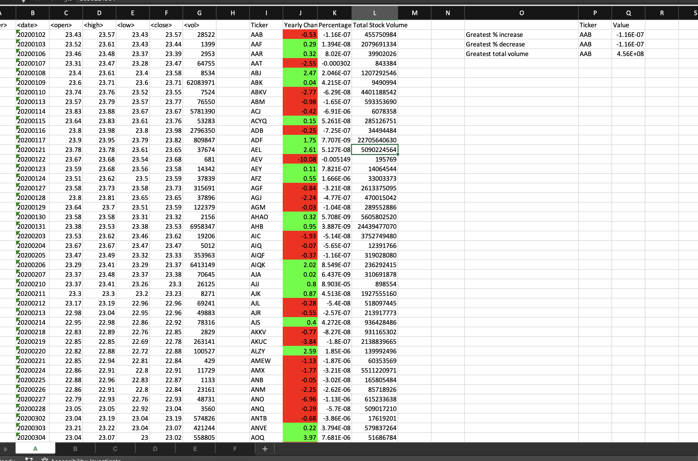
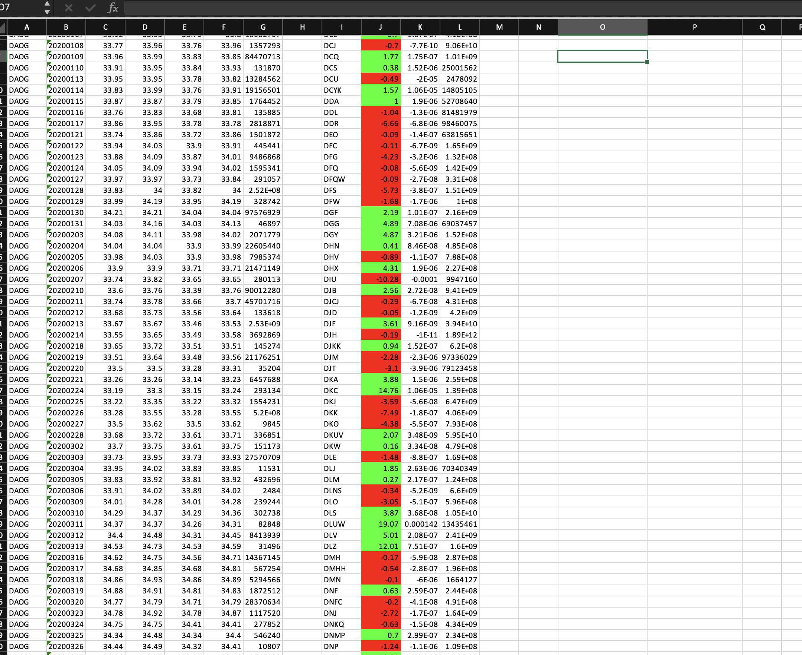

# Homework

You will find  the homework source code in *stockhomework.vb*, however in order to test run it you can open either *alphabetical_testing.xlsm* or *Multiple_year_stock.xlsm*.

Please enable Macros when executing and click on the button "Calculate stocks".

### what you'll find

* Every sheet will execute the script
* Negative % will be marked in red
* Positive % will be marked in green
* two set of values are printed: By ticker info and top values

Note: I wasn't able to find error for calculating the Greatest decrease :(

Another sheet
